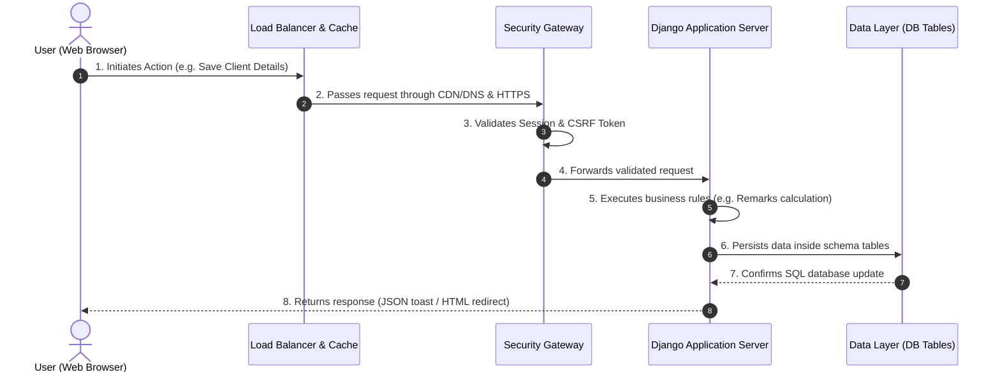

# System Design and Architecture

## 2.1 System Architecture Overview

The SafeBooks platform is designed using a robust, three-tier web-based client-server architecture. This separation of responsibilities guarantees that the presentation, application logic, and data storage layers remain independent, highly maintainable, and secure. The system is built on the Django web framework (Python), integrating customized modules for secure user authentication, client directory management, financial records calculation, and forecasting insights.

The three core tiers are defined as follows:
1. **Presentation Tier (Client Layer)**: Rendered dynamically in user-end web browsers on professional desktop or laptop workstations. It manages user interaction, handles client ledger entry validation, and renders reactive visual tables and forecasting trend charts.
2. **Application Tier (Business Logic Layer)**: Driven by a secure Django application server. It enforces role-based access rules, executes automated bookkeeping client remarks, processes BIR-standard tax aggregates, and calculates rule-based forecasting insights.
3. **Data Tier (Storage Layer)**: Coordinates data persistence through structured database tables and flat attachments storage. SafeBooks utilizes SQLite for active development and is configured to seamlessly support PostgreSQL in production environments.

---

**Figure 5: System Architecture**

Below is the visual system architecture layout of the SafeBooks platform, demonstrating the exact structural topology and directional routing of client queries, caching states, database persistent engines, and security modules based on the academic guidelines:

```mermaid
flowchart LR
    %% Style Definitions
    classDef userStyle fill:#e8f0fe,stroke:#1a73e8,stroke-width:2px,color:#1a73e8,rx:5px,ry:5px;
    classDef gateStyle fill:#fce8e6,stroke:#c5221f,stroke-width:2px,color:#c5221f,rx:5px,ry:5px;
    classDef proxyStyle fill:#e6f4ea,stroke:#137333,stroke-width:2px,color:#137333,rx:5px,ry:5px;
    classDef serverStyle fill:#f3e8fd,stroke:#7627bb,stroke-width:2px,color:#7627bb,rx:5px,ry:5px;
    classDef dbStyle fill:#e2f1f8,stroke:#00796b,stroke-width:2px,color:#00796b,rx:5px,ry:5px;
    classDef cacheStyle fill:#fef7e0,stroke:#b06000,stroke-width:2px,color:#b06000,rx:5px,ry:5px;

    %% Nodes Definitions
    %% Client Layer (Left Column)
    subgraph ClientLayer ["Client Presentation Layer"]
        direction TB
        BK["👤 Bookkeeper User<br>(Primary Operator)"]:::userStyle
        ADM["👥 Administrator Role<br>(System Supervisor)"]:::userStyle
        WEB["🌐 Web Browser Interface<br>(Desktop/Laptop Workstation)"]:::userStyle
    end

    %% Network & Caching Elements (Middle-Left)
    subgraph NetworkLayer ["Gateway & Distribution"]
        direction LR
        CDN_DNS["🌐 CDN & DNS Servers<br>(Cloud Static Assets Cache)"]:::proxyStyle
        LB["🔀 Load Balancer / Reverse Proxy<br>(Traffic Router & SSL Offloader)"]:::proxyStyle
    end
    
    %% Security Central Gatekeeper
    SEC["🔒 Security Gateway<br>(Session & CSRF Validator)"]:::gateStyle

    %% Caching Node
    CACHE["⚡ Session Cache Engine<br>(Key-Value Store)"]:::cacheStyle

    %% Django Application Server Modules
    subgraph AppServers ["Django Application Server Modules"]
        direction TB
        SERV_A["🔒 Authentication Service<br>(auth_service.py)"]:::serverStyle
        SERV_C["👥 Client Service<br>(client_service.py)"]:::serverStyle
        SERV_B["🧮 Financial Record Service<br>(financial_record_service.py)"]:::serverStyle
        SERV_D["📈 Analytics & Forecasting Service<br>(analytics_service.py)"]:::serverStyle
    end

    %% Persistent Storage Tiers
    subgraph StorageLayer ["Data Storage Tier"]
        direction TB
        DB_USERS[("🔐 User Accounts Tables<br>(user_model.py)")]:::dbStyle
        DB_CLIENTS[("📂 Client Profiles Table<br>(client_model.py)")]:::dbStyle
        DB_LEDGER[("🗄️ Financial Records Tables<br>(financial_record_model.py)")]:::dbStyle
    end

    %% Flow Connections (Matching Adviser's Hand-drawn Diagram Exactly)
    %% Client to Security / Gateway
    BK -.->|Dashed: Authentication handshake| SEC
    ADM ===>|Solid: Direct administrative route| SEC
    WEB ===>|Solid: Browser HTTP traffic| CDN_DNS
    
    %% Network distribution routing
    CDN_DNS ===> LB
    LB -.->|Dashed: Session Cache handshake| CACHE
    LB ===>|Solid: Routed client request| SERV_C
    
    %% Cache connection
    CACHE ===>|Solid: Capped data stream| SERV_C

    %% Security Gateway distribution
    SEC -.->|Dashed: Verification route| SERV_A
    SEC ===>|Solid: Direct transaction entry| SERV_B

    %% Django Servers connections to Database cylinders & between servers
    SERV_A ===> DB_USERS
    SERV_C ===> DB_CLIENTS
    SERV_B ===> DB_LEDGER
    SERV_B ===> SERV_D
    SERV_D ===> DB_LEDGER
    SERV_D ===> DB_CLIENTS

    %% Real-time relational synchronization between SQLite/PostgreSQL tables
    DB_CLIENTS ===> DB_LEDGER
    DB_USERS ===> DB_CLIENTS
```

---

## 2.2 Detailed Architectural Components

### 2.2.1 Presentation & Access Channels (Client Layer)
* **Bookkeeper (Primary Client)**: Represents the active operator of the system. The bookkeeper encodes transaction entries, manages client profile directories, analyzes forecasting trends, and generates print-ready report sheets.
* **Administrator (System Admin)**: Represents the supervisor role. The administrator manages system-wide configurations, inspects sequential activity logs, and evaluates newly registered bookkeeper accounts for activation or rejection.
* **Web Workstations**: Primary access interface. The platform is optimized exclusively for standard web browsers running on desktop or laptop viewports (e.g., 15-inch screens). It uses HTML5, CSS3 (Vanilla CSS), and Bootstrap 5 to deliver a professional workspace layout designed for precise financial data entry and multi-row bookkeeping analysis.

### 2.2.2 Gateway & Network Distribution Tier
* **DNS (Domain Name System)**: Translates external network requests (e.g., `safebooks.com` or local `127.0.0.1`) to route client traffic to the appropriate gateway IP address.
* **CDN (Content Delivery Network)**: Caches and distributes lightweight, non-sensitive static assets (such as stylesheets, Javascript files, and visual logos) to minimize server load and speed up browser rendering.
* **Reverse Proxy / Load Balancer**: Positioned in front of the application servers. It directs incoming client traffic, prevents request congestion, offloads SSL/TLS encryption handshakes, and routes packages to active Django worker instances.

### 2.2.3 Security Gateway (The "Security" Layer)
This serves as the centralized gatekeeper for all operational routes. It is tightly bound to Django’s security middleware:
* **HTTPS/SSL (TLS)**: Secures all data transmitted in transit against intercept attacks.
* **Authentication & Authorization**: Enforces role-based permissions, verifying whether a session belongs to an approved bookkeeper or admin.
* **Input Validation & CSRF Protection**: Sanitizes forms on entry and validates secure tokens to block Cross-Site Request Forgery (CSRF) and injection attacks.
* **Static Backdrops & Warning Overlays**: Ensures that modal dialogs cannot be dismissed accidentally and displays custom confirmation prompts if a user attempts to discard dirty unsaved forms.

### 2.2.4 Caching Tier
* **Key-Value Cache Server**: Positioned adjacent to the load balancer and application instances. It caches session states, recurrent SQL queries, and common page fragments to dramatically reduce database read operations and optimize page load speed.

### 2.2.5 Application Tier (Django Server Modules)
The application business logic is modularized into four distinct processing modules to cleanly partition responsibilities and align perfectly with the academic architecture layout:
1. **Authentication Service** (auth_service.py & security_service.py): Manages secure bookkeeper and administrator registrations, credential hashing, session authorizations, and multi-factor setup (TOTP/2FA verification codes).
2. **Client Service** (client_service.py): Handles client profiles (TIN, locations, emails) and executes the **Automated Client Remarks** promotion algorithm (automatically transitioning client remarks: `New`, `Active`, `Separated`, `Closed` based on their filing history).
3. **Financial Record Service** (financial_record_service.py): Processes ledger entry transaction splits (Sales, Expenses, BIR-standard tax form categorization) and computes correct decimal aggregates.
4. **Analytics & Forecasting Service** (analytics_service.py): Computes mathematical expected values (Sales, Expenses, Tax, Net) based on a weighted average of historical data points, applying client-specific growth percentages, and compiles clean ledgers and reports.

### 2.2.6 Data Storage Tier (The Database Tables)
All transaction records and directories are persisted inside a unified relational database engine (SQLite for active development, PostgreSQL-configured for production). The three database cylinders in the architecture layout represent the logical segregation of the primary schema tables:
1. **User Accounts Tables Cylinder** (user_model.py & admin_model.py): Stores accounts, passwords, login timestamps, and dynamic OTP credentials.
2. **Client Profiles Table Cylinder** (client_model.py): Holds registered businesses, TIN numbers, location addresses, permit codes, and computed remarks.
3. **Financial Records Tables Cylinder** (financial_record_model.py, financial_record_line_model.py, period_model.py): Houses Period indices, Financial Records, and ledger Line Items (Sales, Expenses, Tax).

---

## 2.3 Operational Data Flow & Request Lifecycle

A standard user action follows a continuous, secure loop:

---

## 2.4 Explanatory Legend for Connection Paths

To easily explain the lines and connections in the System Architecture diagram during your defense, refer to this functional path legend:

### 2.4.1 Solid Lines (Transactional Data Flow)
* **Definition**: Represent active data exchange, database writing, and browser request routing.
* **Example Paths**:
  * The line from the client **Web Browser** to the **Load Balancer** indicates the transfer of HTTP requests and replies.
  * The lines from the **Application Server** to the **Primary Database Tables** indicate SQL transactional operations (such as saving new records or registering clients).

### 2.4.2 Dashed Lines (Security & Control Handshakes)
* **Definition**: Represent validation handshakes, session token checks, and background caching routes rather than transactional data exchange.
* **Example Paths**:
  * The dashed lines from the **Bookkeeper/Admin** to the **Security Layer** represent session validations and permission handshakes.
  * The dashed line between the **Security Layer** and **Application Server** indicates that Django's security middleware validates the request before allowing it to run any transaction logic.
  * The dashed line from the **Load Balancer** to the **Cache Engine** represents session lookup verification.

### 2.4.3 Inter-Database Vertical Line (Structural Synergy)
* **Definition**: Represents relational database data alignment and structural integrity.
* **Significance**:
  * Shows that all database schema tables are logically synced under a single unified database system.
  * Indicates that transactional data changes in the relational ledger automatically link to the respective client directories and active user accounts, maintaining strict relational integrity.

---

## 2.5 Academic Guidelines & Image Generation Prompt for System Architecture

To generate a clean, professional, and visually accurate System Architecture Blueprint of SafeBooks that strictly adheres to the custom topology required by your adviser without any unnecessary clutter, confusing media storage elements, or messy overlapping arrows, copy the detailed prompt below and paste it into Gemini (in Chrome) or any advanced image generation model:

> **Adviser-Aligned Prompt for System Architecture Diagram Generation:**
>
> "Create a highly professional, enterprise-grade System Architecture Blueprint diagram for a secure financial bookkeeping web platform named 'SafeBooks'. The layout must strictly follow a custom, interconnected network topology rather than a simple layered grid, using a clean technical drawing aesthetic on a light blueprint background (soft off-white with fine engineering grid lines). Nodes should be represented as elegant gray technical cards with crisp black icons and clear, highly legible sans-serif labels. All arrows must be sharp, high-contrast, perfectly straight, and run only horizontally or vertically to connect adjacent columns cleanly without overlapping or crossing each other.
>
> ### Explicit Card Placements and Titles:
> 1. **Presentation & Access Clients (Far Left Column):**
>    - **Top-Left Card**: Labeled with a single-person icon as `'Bookkeeper (Primary Operator)'`.
>    - **Middle-Left Card**: Labeled with a multi-person icon as `'Administrator (System Admin)'`.
>    - **Bottom-Left Card**: Labeled with a web browser window icon as `'Web Browser Interface (15-inch Workspace)'`. [Strictly NO mobile phone nodes].
> 2. **Security Gatekeeper (Center Column - Top):**
>    - **Central Security Card**: A large central card labeled `'Security Gateway (Session & CSRF Validator)'`. Positioned in the middle of the canvas.
> 3. **Proxy Gateway & Network Tiers (Center Column - Bottom):**
>    - **DNS & CDN Clouds**: Positioned at the bottom-center-left, labeled `'CDN & DNS Gateway'` (represented as cloud icons).
>    - **Load Balancer**: A thick vertical bar with three routing dots, positioned directly to the right of the clouds.
> 4. **Caching Node (Center-Right):**
>    - **Session Cache Engine**: Positioned in the middle-left, represented as a database card with key-value table items, labeled `'Session Cache Engine'`.
> 5. **Django Application Logic Servers (Right-Center Modules):**
>    - **Server A (Top Server)**: Labeled `'Authentication Service'`.
>    - **Server B (Middle Server)**: Labeled `'Financial Record Service'`.
>    - **Server C (Middle-Left Server)**: Labeled `'Client Service'`. Positioned directly below the Cache card.
>    - **Server D (Bottom Server)**: Labeled `'Analytics & Forecasting Service'`. Positioned at the bottom.
> 6. **Data Storage & Database Cylinders (Far Right Columns):**
>    - **Top Database Cylinder**: Labeled `'User Accounts Tables'`.
>    - **Middle Database Cylinder**: Labeled `'Client Profiles Table'`.
>    - **Right Database Cylinder**: Labeled `'Financial Records Tables'`.
>
> ### Clean Routing and Arrow Connections Guidelines (Strictly Non-Overlapping):
> - **Solid Lines** represent transactional data routing and SQL operations. **Dashed Lines** represent validation handshakes and cache lookups.
> - **Top Row Routing**: 
>   - `'Bookkeeper'` connects straight right to `'Security Gateway'` via a dashed line.
>   - `'Administrator'` connects straight right to `'Security Gateway'` via a solid line.
>   - `'Security Gateway'` connects straight right-up to `'Authentication Service'` via a dashed line.
>   - `'Authentication Service'` connects straight right to `'User Accounts Tables'` via a solid line.
> - **Middle Row Routing**:
>   - `'Security Gateway'` connects straight right to `'Financial Record Service'` via a solid line.
>   - `'Financial Record Service'` connects straight right to `'Financial Records Tables'` via a solid line.
>   - `'Financial Record Service'` connects straight down to `'Analytics & Forecasting Service'` via a solid vertical line.
> - **Bottom Row Routing**:
>   - `'Web Browser Interface'` connects straight right to `'CDN & DNS Gateway'` via a solid line.
>   - `'CDN & DNS Gateway'` connects straight right to `'Load Balancer'` via a solid line.
>   - `'Load Balancer'` connects straight up-right to `'Session Cache Engine'` via a dashed line.
>   - `'Load Balancer'` connects straight right to `'Client Service'` via a solid line.
>   - `'Session Cache Engine'` connects straight down to `'Client Service'` via a solid vertical line.
>   - `'Client Service'` connects straight right to `'Client Profiles Table'` via a solid line.
> - **Database Synchronization Tiers**:
>   - `'Analytics & Forecasting Service'` connects straight right-up to `'Financial Records Tables'` via a solid line.
>   - `'Client Profiles Table'` connects straight down-right to `'Financial Records Tables'` via a solid line.
>
> ### CRITICAL CLEANLINESS REQUIREMENT:
> Display ONLY the exact titles provided in single quotes above inside each card. Do NOT add any extra sub-text, lists, bullet points, code snippets, database field names, parameters, or random technical data inside the cards. Keep the card interiors extremely clean, containing only the card's single main icon and its exact title. Strictly avoid blurry text, messy overlapping arrows, machine learning graphics, or mobile viewports."

---

## 2.6 Panel Defense Guide: Web-Only System Design

During your defense, the panel may ask: **"Why did you design SafeBooks strictly for Web Browsers (Desktops/Laptops) and did not include a Mobile Application?"**

Refer to these three highly professional, structured academic arguments to answer them successfully:

1. **Ergonomic Screen Real Estate & Input Density**:
   Bookkeeping, ledger aggregation, and tax compliance entries (such as encoding multi-line transaction splits and generating BIR forms) require high screen real estate and physical keyboard navigation to ensure data precision. Small mobile viewports are statistically proven to increase input error rates in financial record-keeping, making desktop web browsers the industry standard for professional operations.
2. **Security & Session Isolation**:
   Accounting data is highly sensitive and subject to strict compliance rules. Restricting platform operational access to authorized web terminals on secure workstations reduces the risk of visual credential theft, shoulder surfing, and physical device theft associated with personal mobile phones.
3. **Responsive Maintenance Cost**:
   By using HTML5, CSS3, and Bootstrap 5 responsive grid layouts, SafeBooks' web-only interface is capable of scaling down to allow bookkeepers to securely view reports or check compliance timelines in emergencies on any browser, without incurring the high security and operational overhead of maintaining a separate native mobile codebase.

---

