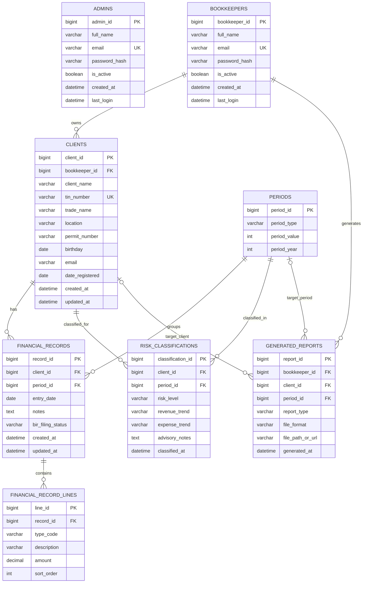

# SAFEBOOKS FINAL ERD (ROLE-SEPARATED AND SYSTEM-ALIGNED)

## Purpose

This ERD is redesigned to match your actual system design and use cases:

1. Admin and Bookkeeper are separate entities.
2. Admin manages bookkeeper accounts only.
3. Bookkeeper manages clients and financial records.
4. Admin has no direct access path to client financial data.

This version removes unnecessary fields (for example, phone number) and keeps only features relevant to your current project scope plus near-term scalability.

---

## Design Principles Used

1. Strict role separation at schema level.
2. Clear data ownership by bookkeeper.
3. Transaction normalization for financial entries and line items.
4. Period-based structure for dashboard and analytics.
5. No extra attributes unless required by current features.

---

## Final Entities And Attributes

### 1) ADMINS

Purpose:
System administration only (manage bookkeeper accounts, monitor users).

Attributes:

- admin_id (PK)
- full_name
- email (unique)
- password_hash
- is_active
- created_at
- last_login

### 2) BOOKKEEPERS

Purpose:
Operational users who own clients and financial records.

Attributes:

- bookkeeper_id (PK)
- full_name
- email (unique)
- password_hash
- is_active
- created_at
- last_login

### 3) CLIENTS

Purpose:
Client profile information managed by one bookkeeper.

Attributes:

- client_id (PK)
- bookkeeper_id (FK -> BOOKKEEPERS.bookkeeper_id)
- client_name
- tin_number
- trade_name (optional)
- location
- permit_number
- birthday (optional)
- email (optional)
- date_registered
- created_at
- updated_at

Recommended unique rule:
- unique(tin_number)

### 4) PERIODS

Purpose:
Reusable period reference for monthly (and future quarterly/annual) grouping.

Attributes:

- period_id (PK)
- period_type (monthly, quarterly, annual)
- period_value (1-12 for month, 1-4 for quarter, 1 for annual)
- period_year

Recommended unique rule:
- unique(period_type, period_value, period_year)

### 5) FINANCIAL_RECORDS

Purpose:
Top-level record entry for a client and period.

Attributes:

- record_id (PK)
- client_id (FK -> CLIENTS.client_id)
- period_id (FK -> PERIODS.period_id)
- entry_date
- notes (optional)
- bir_filing_status (draft, filed, pending, late)
- created_at
- updated_at

### 6) FINANCIAL_RECORD_LINES

Purpose:
Line-item detail per financial record (type/code and amount lines).

Attributes:

- line_id (PK)
- record_id (FK -> FINANCIAL_RECORDS.record_id)
- type_code
- description
- amount (Decimal)
- sort_order

### 7) RISK_CLASSIFICATIONS

Purpose:
Risk result per client and period for dashboard/analytics guidance.

Attributes:

- classification_id (PK)
- client_id (FK -> CLIENTS.client_id)
- period_id (FK -> PERIODS.period_id)
- risk_level (low, medium, high)
- revenue_trend (optional)
- expense_trend (optional)
- advisory_notes (optional)
- classified_at

Recommended unique rule:
- unique(client_id, period_id)

### 8) GENERATED_REPORTS

Purpose:
Track reports created/exported by bookkeepers.

Attributes:

- report_id (PK)
- bookkeeper_id (FK -> BOOKKEEPERS.bookkeeper_id)
- client_id (FK -> CLIENTS.client_id, optional)
- period_id (FK -> PERIODS.period_id, optional)
- report_type (summary, compliance, risk, custom)
- file_format (pdf, xlsx, csv)
- file_path_or_url
- generated_at

---

## Relationship Guide (Cardinality And Meaning)

1. BOOKKEEPERS (1) -> (M) CLIENTS
   - One bookkeeper manages many clients.
   - Each client belongs to exactly one bookkeeper.

2. CLIENTS (1) -> (M) FINANCIAL_RECORDS
   - One client can have many financial records.
   - Each financial record belongs to exactly one client.

3. PERIODS (1) -> (M) FINANCIAL_RECORDS
   - A period can be used by many records.
   - Each financial record points to one period.

4. FINANCIAL_RECORDS (1) -> (M) FINANCIAL_RECORD_LINES
   - One financial record has multiple line items.
   - Each line item belongs to one financial record.

5. CLIENTS (1) -> (M) RISK_CLASSIFICATIONS
   - A client can have multiple classifications over different periods.

6. PERIODS (1) -> (M) RISK_CLASSIFICATIONS
   - A period can have many client classifications.

7. BOOKKEEPERS (1) -> (M) GENERATED_REPORTS
   - A bookkeeper can generate many reports.

8. CLIENTS (1) -> (M) GENERATED_REPORTS (optional link)
   - Report may target a specific client.

9. PERIODS (1) -> (M) GENERATED_REPORTS (optional link)
   - Report may target a specific period.

10. ADMINS -> BOOKKEEPERS (management boundary)
    - Admin manages account state of bookkeepers.
    - No FK from ADMINS to CLIENTS/FINANCIAL_RECORDS is required.
    - This enforces separation of operational data responsibility.

---

## Access Boundary Rules (Critical)

These rules define your security model and must be enforced in backend logic:

1. Admin can:
   - View registered bookkeepers.
   - Deactivate/reactivate bookkeeper accounts.
   - Reset bookkeeper passwords.

2. Admin cannot:
   - Create, view, update, or delete client financial records.
   - Access FINANCIAL_RECORDS, FINANCIAL_RECORD_LINES, or client-linked analytics data directly.

3. Bookkeeper can:
   - Manage own clients.
   - Manage own financial records and line items.
   - Generate reports for owned client data.

4. Data ownership rule:
   - Every client row is scoped by bookkeeper_id.
   - Every financial record is reachable only through a client owned by the logged-in bookkeeper.

5. Query enforcement pattern:
   - Always filter operational data by logged-in bookkeeper ownership.
   - Example: records where client.bookkeeper_id = current_bookkeeper_id.

---

## Corrected ERD Diagram (Mermaid)

---

## Mapping To Your Use Case Diagram

1. Add/Edit/View Client Profile
   - CLIENTS (owned by BOOKKEEPERS)

2. Record Monthly Data / View Financial Records / Update Financial Records
   - FINANCIAL_RECORDS + FINANCIAL_RECORD_LINES + PERIODS

3. Generate Financial Trends / Predictive Analysis Inputs
   - Aggregation from FINANCIAL_RECORDS and FINANCIAL_RECORD_LINES by PERIODS

4. Classify Client Risk Level / Generate Advisory Notes
   - RISK_CLASSIFICATIONS

5. Generate Reports / Export Reports
   - GENERATED_REPORTS

6. Manage User Accounts / Deactivate Bookkeeper / Reset Password / View Registered Bookkeepers
   - ADMINS and BOOKKEEPERS (account management only)

---

## Django Implementation Notes

Recommended model names:

- Admin
- Bookkeeper
- Client
- Period
- FinancialRecord
- FinancialRecordLine
- RiskClassification
- GeneratedReport

Recommended indexes:

- CLIENTS(bookkeeper_id)
- CLIENTS(tin_number)
- FINANCIAL_RECORDS(client_id, period_id)
- FINANCIAL_RECORD_LINES(record_id)
- RISK_CLASSIFICATIONS(client_id, period_id)
- GENERATED_REPORTS(bookkeeper_id, generated_at)

---

## Final Decision

This ERD is now aligned to your requested role separation and system boundaries:

1. Admin and Bookkeeper are separate entities.
2. Admin functions are account-management only.
3. Bookkeeper owns client and financial data.
4. No unnecessary fields were added.

Use this as the official database baseline before starting backend model creation and migrations.
